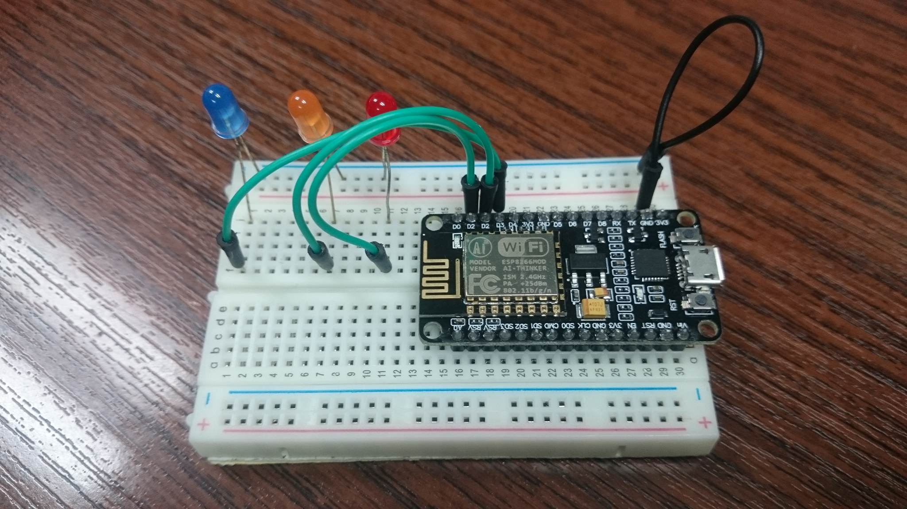
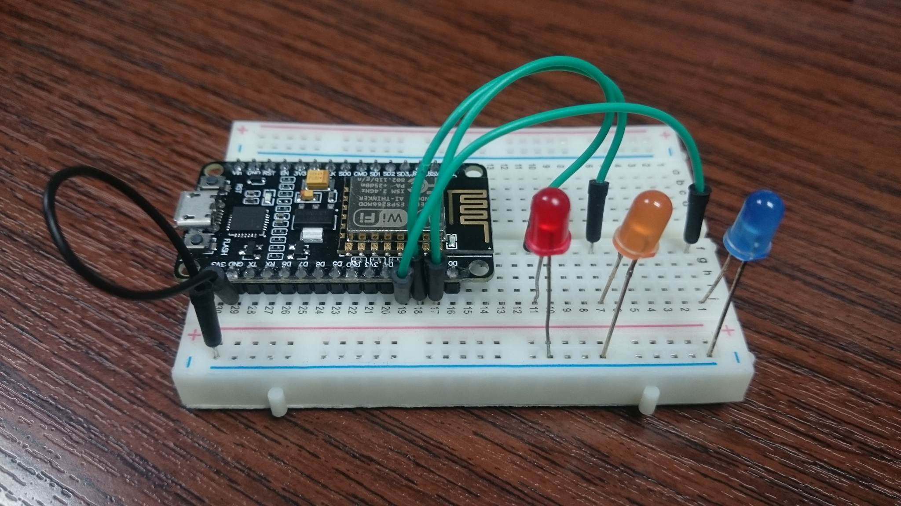
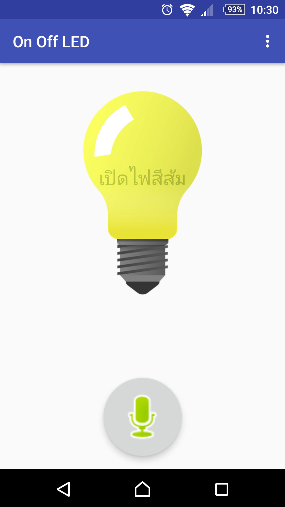

# Partii_OnOff_LED
ตัวอย่างแอพสั่งเปิดปิด LED อย่างง่ายเชื่อมต่อกับ NETPIE

  
  
  

ค่าที่นักพัฒนาจำเป็นต้องตั้งค่าให้ถูกต้องจาก NETPIE สำหรับแอพ android คือ  
private String appid = ""; //APP_ID  
private String key = ""; //KEY  
private String secret = ""; //SECRET  
	

ค่าที่นักพัฒนาจำเป็นต้องตั้งค่าให้ถูกต้องจาก NETPIE สำหรับ Nodemcu คือ  
const char* ssid     = ""; // wifi name  
const char* password = ""; // wifi password  
#define APPID   "" // NETPIE APP ID  
#define KEY     "" // NETPIE KEY  
#define SECRET  "" // NETPIE SECRET KEY  
	
	
	
ตัวอย่างการใช้งานนี้ผู้ใช้งานสามารถสั่งคำสั่งด้วยการพูดคำสั่งดังต่อไปนี้  
	เปิดไฟสีแดง 
	เปิดไฟสีส้ม 
	เปิดไฟสีน้ำเงิน 
	ปิดไฟสีแดง 
	ปิดไฟสีส้ม 
	ปิดไฟสีน้ำเงิน 
	ปิดไฟทุกดวง 
	เปิดไฟทุกดวง 
